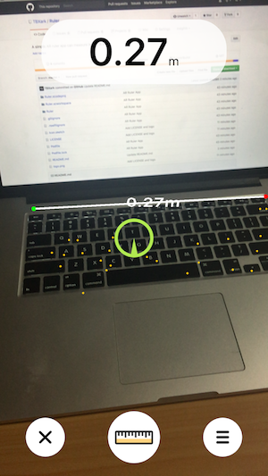
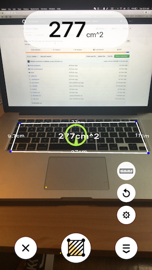

# Ruler
> A simple Augmented Reality ruler app which can measure length.

## Requirements

- Swift 4.0
- iOS 11.0
- Xcode 9.0

## Preview

1. Mesure Length 

youtube : [https://youtu.be/2wKLUqPizfQ](https://youtu.be/2wKLUqPizfQ)

 

2. Mesure Area 

youtube : [https://youtu.be/gRd1Ag4C7lU](https://youtu.be/gRd1Ag4C7lU)

## Install

- Manually compile
  1.  `git clone https://github.com/TBXark/Ruler `
  2. `pod install`
  3. Compile project with Xcode

## Meta

TBXark – [@tbxark](https://twitter.com/tbxark) – tbxark@outlook.com

Distributed under the MIT license. See ``LICENSE`` for more information.

[https://github.com/TBXark](https://github.com/TBXark)

[swift-image]:https://img.shields.io/badge/swift-3.0-orange.svg
[swift-url]: https://swift.org/
[license-image]: https://img.shields.io/badge/License-MIT-blue.svg
[license-url]: LICENSE
[travis-image]: https://img.shields.io/travis/dbader/node-datadog-metrics/master.svg?style=flat-square
[travis-url]: https://travis-ci.org/dbader/node-datadog-metrics
[codebeat-image]: https://codebeat.co/badges/c19b47ea-2f9d-45df-8458-b2d952fe9dad
[codebeat-url]: https://codebeat.co/projects/github-com-vsouza-awesomeios-com
